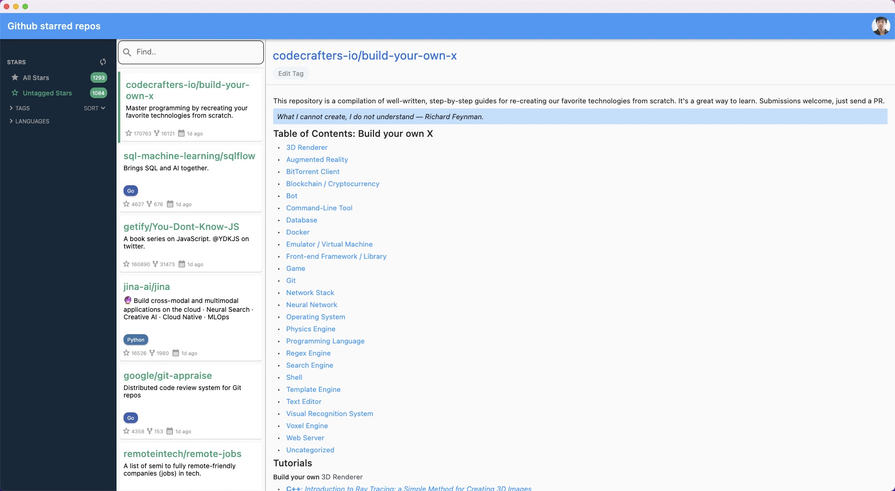

> 目前仅在Macos下测试使用. Windowns平台未测试

日常Github Star的项目越来越多, 经常想到一个曾经见过的项目却找不到. 于是在空闲时间参考[astralapp/astral](https://github.com/astralapp/astral)项目, 用Flutter开发了此项目. 通过给项目打标签的方式整理和归类,在需要的时候快速找到想要的项目.

由于是练手的项目, 难免会有很多问题. 不过日常也够用了. 国内访问github经常超时, 项目内可设置http代理.
## 项目截图

